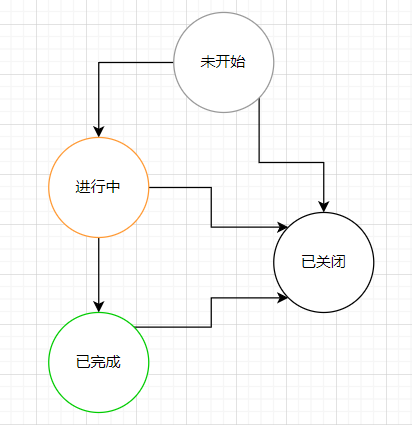

# 项目服务
项目服务是任务管理中非常重要的一个服务，它用于处理任务，任务状态流转等逻辑。

## 设计要点

基于“场景”模式，用户可以自己新建“场景”，场景对应着一批状态/状态流转。

### 场景
一个场景对应多个状态，状态的流转是事先设计好的。

状态类型 | 枚举值| 说明
|:---- |:---|:---- |
| 未开始 | `1` | - |
| 进行中 | `2` | - |
| 已完成 | `3` | - |
| 已关闭 | `4` | - |

状态的流转可以视为一种状态机，如下所示：



## 模型

```

```